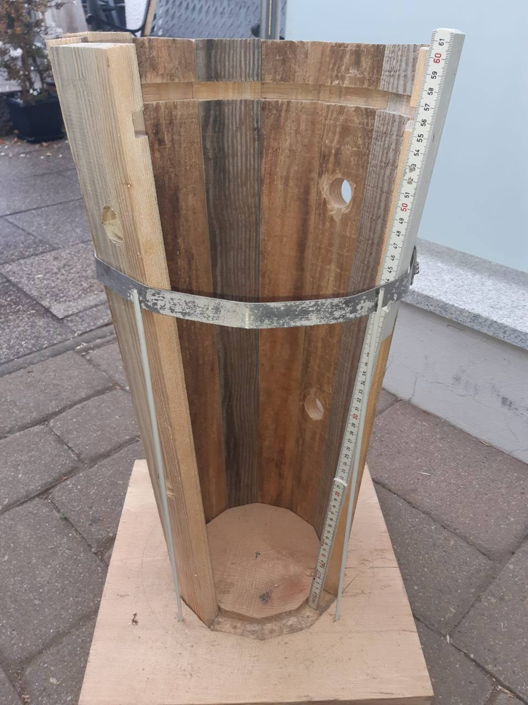
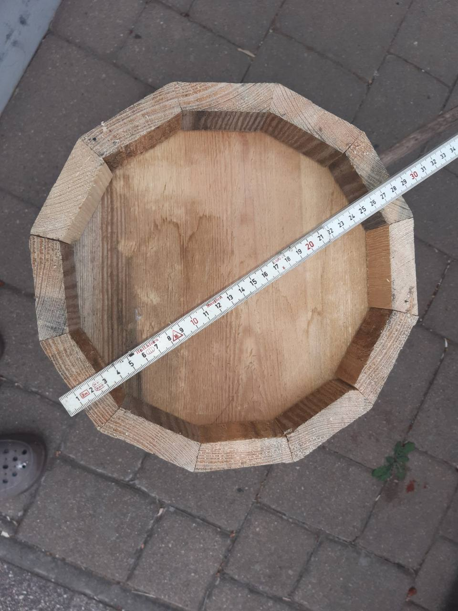
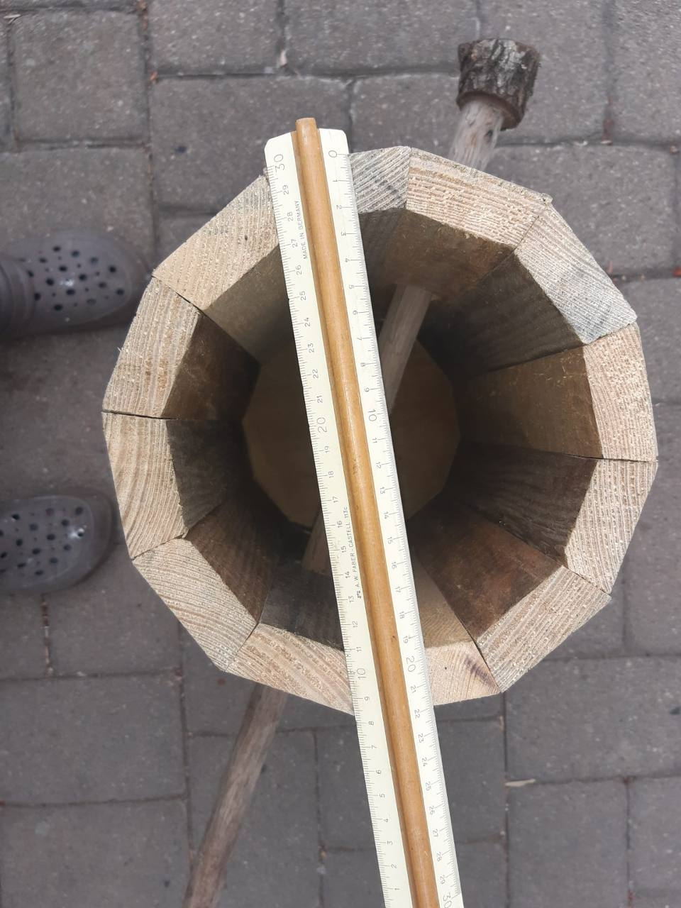
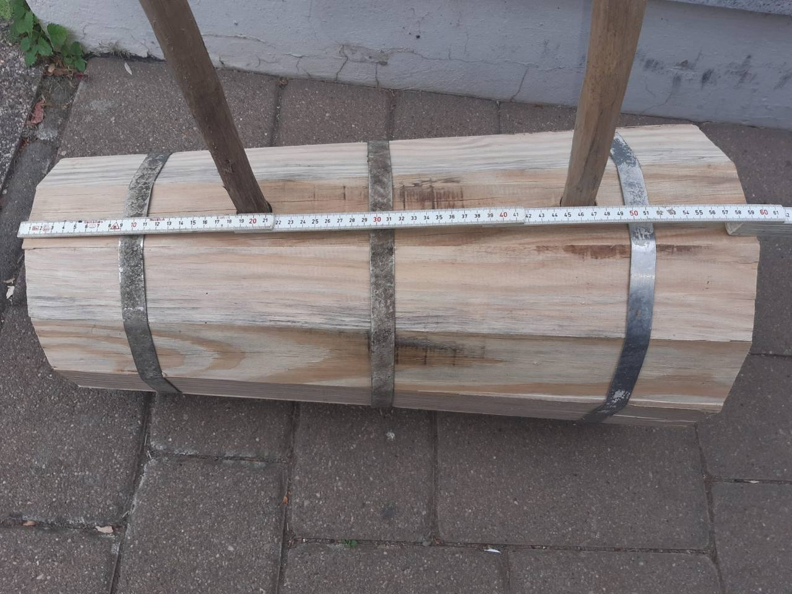

# Fachbeitrag: Aufbau eines Kumpfes

Erfasst am 2026-10-08. Quelle: ThorstenHalsch, in der Rolle als Fachkenner, mit vier hochgeladenen Originalfotos und zugehöriger Erklärung im Projektgespräch. Das Datum ist das Erfassungsdatum; Aufnahmedatum und Einbaugeschichte sind noch nicht angegeben.

## Fachliche Angaben

Der gezeigte Kumpf besteht aus **zwölf Dauben und einem Kumpfboden**. Eine Einfräsung unten in den Dauben nimmt beim Zusammenbau den Boden auf. **Drei Metallbänder** halten den Kumpf zusammen.

Die Bilder zeigen denselben Kumpf aus verschiedenen Richtungen und teilweise zerlegt zur Erläuterung des Aufbaus. Die Zuordnung als derselbe Kumpf stammt vom Fachkenner; eine inventarisierte physische Teil-ID liegt noch nicht vor.

Der Fachkenner erklärt ausdrücklich: Bei den vorhandenen Bandzeichnungen wurden damals unterschiedliche Derivate mit unterschiedlichen Maßen gefertigt. Der hier fotografierte Kumpf hat nach seiner Aussage das richtige Maß und soll die Maßreferenz für diese Zuordnung sein. Daraus folgt keine pauschale Ungültigkeit der anderen Zeichnungen oder die Gleichheit sämtlicher Kümpfe am Rad.

## Bilder und sichtbare Details

### 1000046420.jpg — teilweise zerlegter Kumpf

Die geöffneten Dauben zeigen die innere Einfräsung deutlich; ein runder Boden und eine Längenskala sind sichtbar. „Unten“ in der Erklärung bezeichnet die funktionale Bodenposition, unabhängig von der Ausrichtung des Demonstrationsstücks im Foto. Ein sichtbares Band in dieser Teilansicht widerlegt die fachlich genannte Gesamtzahl drei nicht.

### 1000046421.jpg — Stirnansicht mit Boden und Maßstab

Boden, Daubenstirnflächen und eine über den Querschnitt gelegte Skala sind sichtbar. Für ein Maß müssen beide Bezugskanten und deren Skalenwerte bestimmt werden; die höchste sichtbare Skalenmarke allein ist kein Durchmesser.

### 1000046422.jpg — Blick in den Kumpf

Sichtbar sind Dauben, innerer Boden, ein Maßstab und durch die Wand reichende Hölzer. Deren konkrete Funktion, Befestigung und Benennung werden durch diesen Beitrag noch nicht erklärt.

### 1000046423.jpg — Außenansicht

Drei Metallbänder sind gemeinsam sichtbar. Eine Längenskala und zwei aus der Wand ragende Hölzer ergänzen den Einbaukontext; deren Funktion bleibt bis zur fachlichen Erklärung offen.

## Verknüpfung mit vorhandenen Zeichnungen

- [IMG_6821.jpeg](../evidence/raw/IMG_6821.jpeg): bisher transkribierte Längenreihe **780 / 875 / 968**, außerdem **4 cm Überlappung** und drei Nieten. Die Längenreihe hat im strukturierten Bestand keine bestätigte Einheit.
- [IMG_6846.jpeg](../evidence/raw/IMG_6846.jpeg) und [IMG_6847.jpeg](../evidence/raw/IMG_6847.jpeg): transkribierte Längen **972 / 880 / 784**, ebenfalls ohne bestätigte Einheit in den Claims.
- [Bestehende Variantenfrage CONFLICT-02](../data/conflicts.json): bisher offen, mit möglichen Erklärungen Überlappung, Fertigungsänderung und Gefäßvarianten.
- Betroffene Familien: COMP-KUEMPFE, COMP-KUMPF-STAVES, COMP-KUMPF-BASE, COMP-KUMPF-HOOPS.

Die neue Fachauskunft belegt, dass unterschiedliche gefertigte Varianten existierten. Sie ergänzt CONFLICT-02; sie wählt noch keine der transkribierten Längenreihen numerisch aus. Originalzeichnungen und bisherige Aussagen bleiben nachvollziehbar erhalten.

## Bandlänge aus dem Kumpfumfang abschätzen

Die fachliche Anweisung lautet, die passende Bandlänge aus dem Umfang des fotografierten Kumpfes mit seinen Bemaßungen abzuschätzen.

Für jedes der drei Bänder ist der **Außenumfang an seiner jeweiligen Sitzposition** maßgeblich. Öffnungs- oder Bodendurchmesser allein bestimmen nicht alle drei Umfänge. Bei unterschiedlichem Querschnitt entlang der Länge muss jeder Bandsitz separat betrachtet werden.

Als erste kreisförmige Näherung gilt U ≈ π · D außen. Bei zwölf ebenen Dauben ist ein regelmäßiges Zwölfeck als technische Näherung genauer: U = 12 · Seitenbreite; mit Außenmaß über gegenüberliegende Flächen F gilt U = 12 · F · tan(π/12), mit Außenmaß über gegenüberliegende Ecken E gilt U = 12 · E · sin(π/12). Regelmäßigkeit und Maßbezug sind Annahmen und müssen zum tatsächlichen Stück passen.

Die gestreckte Bandlänge ist näherungsweise **L = Umfang am Bandsitz + Überlappung**. Die 4 cm stammen aus einer historischen Zeichnung und sind für den fotografierten Verschluss noch nicht bestätigt; die Banddicke kann für eine genauere Abwicklung zusätzlich relevant sein.

Noch kein Zahlenwert wird als direkte Messung oder Fertigungsmaß ausgegeben. Zur nachvollziehbaren Schätzung fehlen bisher eindeutige Fotoablesungen der Außenquerschnitte an allen drei Bandsitzen und die Zuordnung der Maßvarianten. Eine spätere Schätzung muss Bild, Bezugskanten, Skalenwerte, Annahmen und Unsicherheit nennen.

## Übergabe an Astra

Die fachlich bestätigten Angaben 12 Dauben, 1 Boden, Bodenaufnahme in der Einfräsung und 3 Metallbänder als neue expert-narrative-Quelle berücksichtigen. Insbesondere die bisher offenen Stückzahlen in data/components.json gezielt abgleichen. Die Fotos stützen Aufbau und sichtbare Details; nicht jedes Maß ist damit kalibriert.

Die Erklärung zu gefertigten Bandvarianten bei CONFLICT-02 berücksichtigen und den fotografierten Kumpf als vom Fachkenner benannte passende Referenz nutzen. Historische Maße, fachliche Bestätigung, visuelle Beobachtung und rechnerische Schätzung getrennt führen.

Maschinenlesbare Quelle, atomare Aussagen und Prüfsummen: [kumpf-20261008.json](../evidence/contributions/kumpf-20261008.json). Dieser Beitrag ergänzt den bestehenden Evidenzbestand; er ist noch nicht in Modellparameter oder die alte Claims-Datei integriert.
